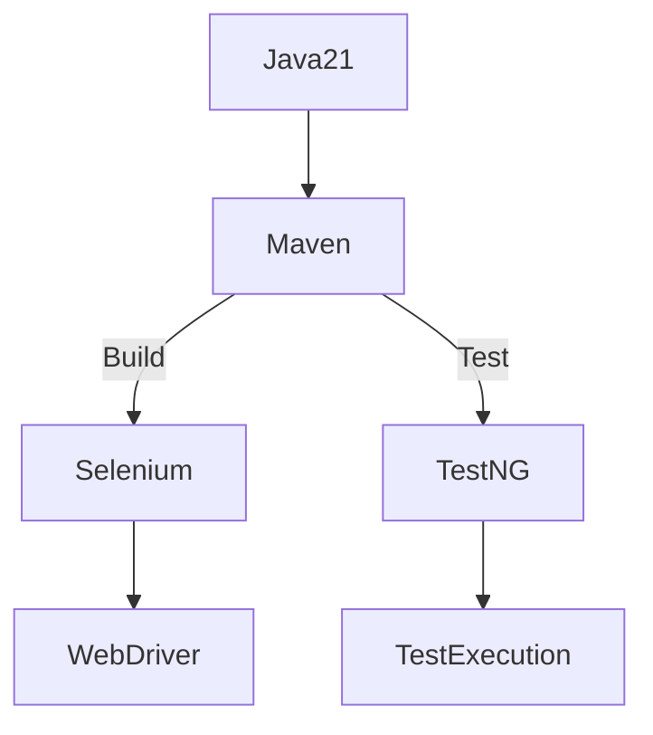
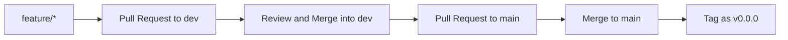

# 🚀 Selenium Automation Framework 
**Initial Maven Configuration-(v0.0.0)**

> A scalable and modular automation framework foundation using Java, Selenium WebDriver, and TestNG.

---

## 📚 Table of Contents
1. [Project Overview](#project-overview)
2. [Technical Architecture](#technical-architecture)
3. [Branching Strategy](#branching-strategy)
4. [Versioning Scheme](#versioning-scheme)
5. [Initial Setup](#initial-setup)
6. [Dependencies](#dependencies)
7. [Build Configuration](#build-configuration)
8. [Development Workflow](#development-workflow)
9. [Future Roadmap](#future-roadmap)
10. [Contributing](#contributing)
11. [Author](#author)
12. [License](license)
---

## 📌 Project Overview
This project establishes the foundation for a robust Selenium WebDriver automation framework using **Java 21**, **TestNG**, and **Maven**.

### 🎯 Goals of v0.0.0:
- Set up initial Maven `pom.xml` with Java 21 compatibility.
- Add Selenium and TestNG dependencies.
- Configure Maven Compiler and Clean plugins.

---

## 🧱 Technical Architecture

### 📁 Initial Folder Structure
```
selenium-framework/
├── src/
│   ├── main/java/          # Core framework components (future)
│   ├── test/java/          # Test classes (future)
│   └── test/resources/     # Configuration files (future)
├── target/                 # Build output directory
├── pom.xml                 # Maven configuration
└── README.md               # Project documentation
```

### 📦 Dependency Graph (v0.0.0)


---

## 🌿 Branching Strategy

We follow **Git Flow** with the following branches:


- `main`: Stable production-ready code
- `dev`: Integration branch for completed features
- `feature/*`: Feature-specific development branches

---

## 🧮 Versioning Scheme

We follow **Semantic Versioning (SemVer)**:

- `MAJOR`: Breaking changes
- `MINOR`: Backward-compatible features
- `PATCH`: Bug fixes

Current version: **v0.0.0**

---

## ⚙️ Initial Setup

### ✅ Prerequisites
- Java 21 JDK
- Maven 3.6+
- Git 2.30+

### 💻 Installation
```bash
git clone https://github.com/your-repo/selenium-framework.git
cd selenium-framework
mvn clean install
```

---

## 📦 Dependencies

### 🔧 Core Dependencies

| Dependency     | Version    | Purpose                  |
|----------------|------------|--------------------------|
| Selenium Java  | `4.34.0`   | WebDriver implementation |
| TestNG         | `7.11.0`   | Testing framework        |
| Java           | `21`       | Runtime environment      |

### 🔨 Plugins

| Plugin                | Version | Purpose                  |
|-----------------------|---------|--------------------------|
| Maven Compiler Plugin | `3.14.0`  | Java 21 compilation      |
| Maven Clean Plugin    | `3.5.0`   | Cleans target directory  |

---

## 🏗️ Build Configuration

### 🧾 pom.xml Highlights
```xml
<properties>
    <project.build.sourceEncoding>UTF-8</project.build.sourceEncoding>
    <selenium.version>4.34.0</selenium.version>
    <testng.version>7.11.0</testng.version>
</properties>

<dependencies>
    <dependency>
        <groupId>org.seleniumhq.selenium</groupId>
        <artifactId>selenium-java</artifactId>
        <version>${selenium.version}</version>
    </dependency>
    <dependency>
        <groupId>org.testng</groupId>
        <artifactId>testng</artifactId>
        <version>${testng.version}</version>
        <scope>test</scope>
    </dependency>
</dependencies>

<build>
    <plugins>
        <plugin>
            <groupId>org.apache.maven.plugins</groupId>
            <artifactId>maven-compiler-plugin</artifactId>
            <version>3.14.0</version>
            <configuration>
                <release>21</release>
            </configuration>
        </plugin>
        <plugin>
            <groupId>org.apache.maven.plugins</groupId>
            <artifactId>maven-clean-plugin</artifactId>
            <version>3.5.0</version>
        </plugin>
    </plugins>
</build>
```

---

## 🔁 Development Workflow



---

## 🛣️ Future Roadmap

| Version | Feature(s)                                                                | Status     | Target Date |
| ------- | ------------------------------------------------------------------------- |----------  | ----------- |
| v0.0.0  | Initial Maven configuration (pom.xml with dependencies and plugins)       | 🚧 WIP     | 03-Aug-2025 |
| v0.1.0  | First test: `TextBoxTest`                                                 | ⏳ Planned | 06-Aug-2025 | 
| v0.2.0  | Configuration manager (`ConfigManager.java`, `config.properties`) + CI/CD | ⏳ Planned | 09-Aug-2025 | 
| v0.3.0  | Log4j2 logging integration                                                | ⏳ Planned | 12-Aug-2025 | 
| v0.4.0  | Robust exception handling                                                 | ⏳ Planned | 15-Aug-2025 | 
| v0.5.0  | WebDriver setup (`DriverFactory`, `DriverManager`, `BaseTest`)            | ⏳ Planned | 18-Aug-2025 | 
| v0.6.0  | Page Object Model (`BasePage`, `TextBoxPage`)                             | ⏳ Planned | 21-Aug-2025 | 
| v0.7.0  | Wait utility enhancements                                                 | ⏳ Planned | 24-Aug-2025 | 
| v0.8.0  | Screenshot capture for failed tests                                       | ⏳ Planned | 27-Aug-2025 | 
| v0.9.0  | TestNG listeners integration                                              | ⏳ Planned | 30-Aug-2025 | 
| v1.0.0  | Allure Reports with logs & screenshots                                    | ⏳ Planned | 03-Sep-2025 | 
| v1.1.0  | Retry mechanism (max 3 immediate retries)                                 | ⏳ Planned | 06-Sep-2025 |


---

## 🤝 Contributing

```bash
# Fork the repository
# Create feature branch
git checkout -b feature/your-feature

# Commit changes
git commit -am "Add your feature"

# Push to origin
git push origin feature/your-feature

# Create Pull Request on GitHub
```

---

## 👨‍💻 Author

**ANUJ KUMAR** 🏅 QA Consultant & Test Automation Engineer
- 📧 Email: [anujpatiyal@live.in](mailto:anujpatiyal@live.in)
- 🌐 Website: *(coming soon)*
- 🔗 [LinkedIn Profile](https://www.linkedin.com/in/anuj-kumar-qa/)

---

## 📜 License
Distributed under the [MIT License](https://opensource.org/licenses/MIT).

> “First, solve the problem. Then, write the code.” – John Johnson

> This framework adheres to this principle with its configuration-first approach.
